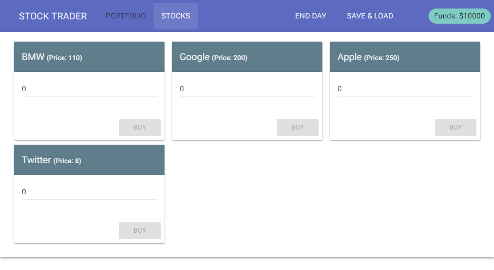

# Stock Trader

Live version can be found [here](http://nataliatepluhina.github.io/vue-stock-trader/index.html).

Serverless responsive single-page application simulating stock trading. 
At the start you have a $10.000 and can buy stocks, then randomize stocks prices clicking "End Day" and sell stocks from you portfolio.
You can save and load your current stocks portfolio whenever you want.

Technologies used:

* Vue.js 2.0 + Vuex
* Material Design
* Google Firebase database as backend
* Webpack